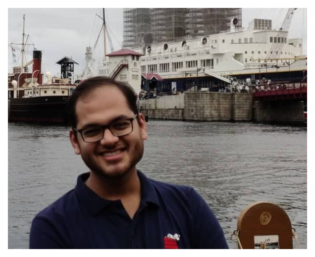

Hi there! I am Yashvardhan Didwania, a senior undergraduate at [IIT Bombay](iitb.ac.in) and pursuing a Dual Degree in Electrical Engineering and a Minor in Computer Science an Engineering.

I am working on optimizing worker and price selection on various Crowd-labelling platforms as part of my Master's thesis with [Prof JK Nair](https://www.ee.iitb.ac.in/~jayakrishnan.nair/). In the past I was a Security Engineering Intern at Sony, Japan during the Summer of 2019 and completed a [GSoC](http://localhost:4000/2018/05/01/gsoc-selection.html) with Mozilla in 2018. You can take a look at my [resume][resume] to know more about other projects I have worked on in the past.

I have been closely involved with the student community at IIT Bombay. I used to lead the [The Web and Coding Club][WnCC] of IIT Bombay, where we help those who want to get started with code. I am also a co-founder of our [Developers' Community](https://devcom-iitb.org/), where we design and build software products aimed at significantly enhancing the digital infrastructure of IIT Bombay with a lasting impact on its residents. 

Recently I have started reading about different startups in India and it amazes me how difficult it is to even solve a simple problem and then create a sustainable business around it. In other things, I am curious about the aviation industry (the business more than the planes). I also like to read, mostly non-fiction and  try to write a few lines ocassionally in moments of sudden inspiration. 

[projects]: /projects
[WnCC]: http://wncc-iitb.org
[github]: http://github.com/ydidwania
[resume]: {{site.url}}/assets/resume.pdf
